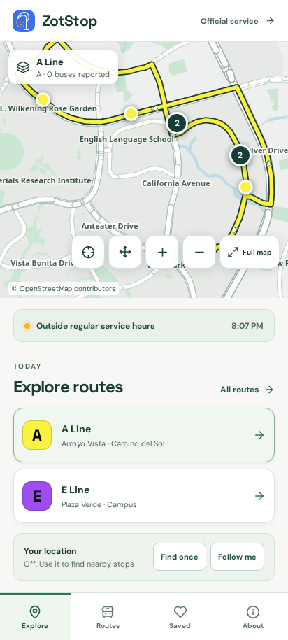

# ZotStop

Follow Anteater Express buses at UC Irvine. See routes together, check the stops they serve, and save the view you use.

**[Open ZotStop](https://zotstop-edge-proxy.theedenwatcher.workers.dev/)** · **[Download for Android](https://github.com/ShortTimeNoSee/ZotStop/releases/latest)** · **[Get help](https://github.com/ShortTimeNoSee/ZotStop/issues)**

[](https://github.com/ShortTimeNoSee/ZotStop/actions/workflows/ci.yml)



## See your options together

- **Compare routes.** Choose any combination on the map. Route colors match the operator’s feed, direction arrows show the journey, and shared sections separate into parallel lines as you zoom out.
- **Find the right stop.** Open a stop for the routes that serve it, available arrival estimates, boarding guidance, and the next stop in each route’s sequence. Nearby leads with the next departure at each stop in walking distance, or around campus when location is off.
- **Search stops and lines.** One field matches stop names, stop codes, landmarks, and line names in the loaded feed. The last eight stops you open stay on this device and show when the field is empty.
- **Timed stops.** When the operator feed marks a stop as a timepoint, the stop says the bus waits for the published time. Other stops can be passed when nobody is waiting at the sign and nobody on board has requested the stop.
- **Send a stop.** The open screen, line, and stop are in the page link. A refresh or a texted link opens that stop again. Your location is not part of the link.
- **Keep your own view.** Save stops, watch arrivals across selected routes, and save a named combination of routes and watched stops. Rename it whenever you like. Your route selection and map position are remembered on this device.
- **Explore the map.** Pan, pinch, rotate, or open the full map. Buttons provide zoom, pan, and reset controls, and stops remain available in a list.
- **Use it without location.** Browse every route manually. Find once places a location marker without continuing to track. Follow me updates your position while the app is open, with controls to pause or stop.
- **Know when to get off.** At a stop, follow with this phone or select the bus printed on the vehicle. You can also tap that bus on the map. A bus alert can be early or late if the operator's report is delayed. A phone alert stays on the device and uses a reported bus only when exactly one is close. Sharing a ride is a separate choice.
- **Keep browsing offline.** The Android app includes the campus map and routes. The web app caches them after a successful load. Live arrivals need a connection.

## Start riding

### Web and home screen

Open [ZotStop](https://zotstop-edge-proxy.theedenwatcher.workers.dev/) in a current browser. On Android, use the browser’s install or add to home screen option. On iPhone or iPad, open it in Safari and choose **Share → Add to Home Screen**. It also works as a regular desktop website.

### Android

Download the `.apk` from the [latest release](https://github.com/ShortTimeNoSee/ZotStop/releases/latest) and open it on your device. Allow your browser or file manager to install apps if Android asks. Future releases signed with the same key can update the installation.

Android 7.0 or newer is required, with an up to date system WebView. Google Play Services are not required. Location permission is optional. On devices with multiple profiles, install and grant permissions in the profile where you use ZotStop.

### Choose your routes

1. Open the route summary at the top of the map.
2. Select the routes you want to see together.
3. Tap a stop to see arrivals for the selected routes that serve it. Use **Watch this stop** to bring those arrivals into Explore.
4. Save the view from the route picker and give it a name. Open it again from **Saved**.

Check the route letter and destination on the bus before boarding. For current detours, holidays, and operating schedules, consult [Anteater Express](https://shuttle.uci.edu/).

## About live information

Bus positions and arrival estimates come from the operator. An old position is marked as delayed, and unsupported countdowns are removed. When recent travel between published timing points is slower than scheduled, ZotStop may show a wider downstream arrival range rather than imply false precision. No reported vehicles does not necessarily mean no buses are running. During an outage, ZotStop keeps available cached information and shows its age.

If you choose **Share ride** while on a bus, your reports can contribute an approximate gold area on the map. A hint needs at least two qualifying ride sessions. These reports are unverified and never replace the operator’s arrival estimates. Sharing stops when location tracking is paused or stopped.

ZotStop is actively developed. Web/PWA and Android are available now. iOS source and simulator tests are included, but there is no published native iOS release. Map coverage is limited to the campus transit area. Live data, route geometry, and boarding guidance can be incomplete or out of date.

## Your data

No account is needed. Saved stops, views, and ordinary location use stay on your device.

**Share ride is different:** it sends precise location fixes to ZotStop’s Cloudflare relay for route validation. The relay stores coarse route progress under a temporary ride ID, rather than the exact fix. Optional randomized usage counts are off by default. The hosting provider receives network requests, including IP addresses.

Read [Privacy](PRIVACY.md) for what is sent, stored, and deleted.

## Run locally

Use Node.js **24.20.0**, pnpm **11.26.0**, and Python **3.13** for the same tool versions used in CI.

```sh
git clone https://github.com/ShortTimeNoSee/ZotStop.git
cd ZotStop
pnpm install --frozen-lockfile
pnpm dev
```

Open the local address printed by Vite. Route and map data are already included. The development server retrieves live operator data, so you do not need an API key to browse routes or arrivals. Ride sharing and usage ingestion require the Worker, described in [Development](docs/development.md).

## Help improve ZotStop

Report bugs, suggest changes, or describe an accessibility issue in [GitHub Issues](https://github.com/ShortTimeNoSee/ZotStop/issues). Include your app version, device or browser, and steps to reproduce. Please remove personal locations and notifications from screenshots.

Code, data corrections, and documentation contributions are welcome. See [Contributing](CONTRIBUTING.md), [Development](docs/development.md), and the [Changelog](CHANGELOG.md). Report vulnerabilities through the [private security channel](https://github.com/ShortTimeNoSee/ZotStop/security/advisories/new).

## Credits and license

Created and maintained by [Nicholas Thompson](https://github.com/ShortTimeNoSee). Thanks to Anteater Express for its public transit information and [OpenStreetMap contributors](https://www.openstreetmap.org/copyright) for the campus map.

ZotStop is independent and is not affiliated with UC Irvine or Anteater Express.

Code is licensed under [GNU AGPLv3](LICENSE). OpenStreetMap data is available under the [Open Database License](https://www.openstreetmap.org/copyright). Transit information comes from the operator and is not covered by the app’s code license.
