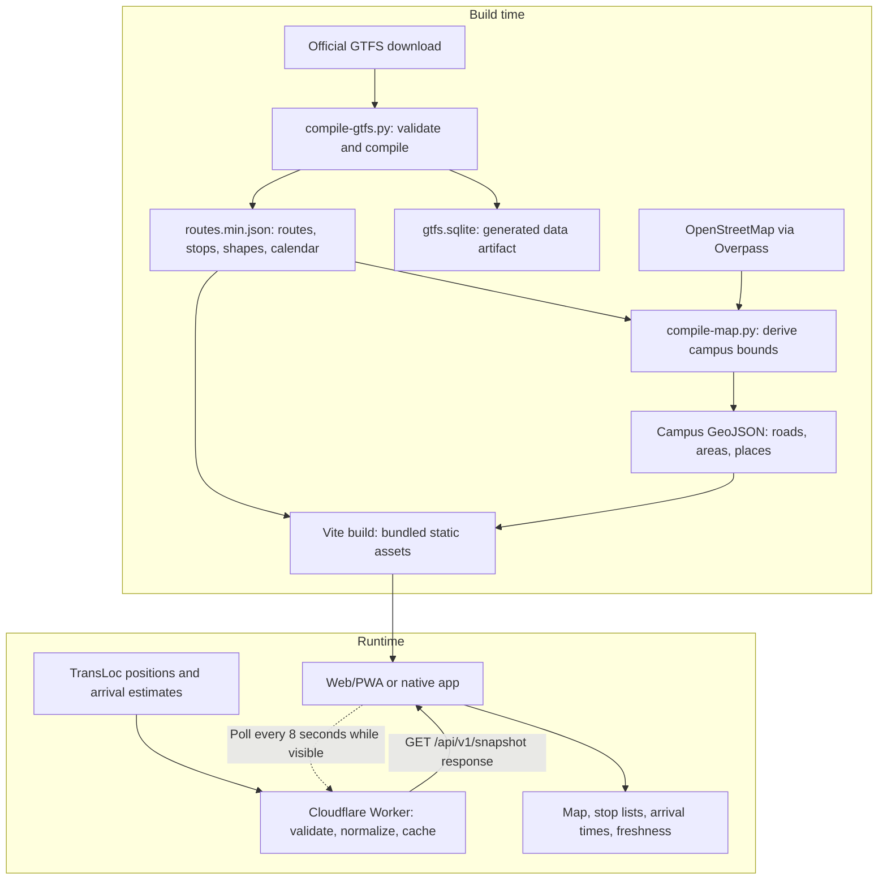

# Development

[Back to the README](../README.md) · [Contributing](../CONTRIBUTING.md)

## Toolchain

| Work | Requirements |
| --- | --- |
| Web and shared packages | Node.js 24.20.0 and pnpm 11.26.0 |
| Feed scripts and Python tests | Python 3.13, using the standard library |
| Android build | JDK 21, Android SDK platform 36 and build tools 35.0.0 |
| Android UI checks | API 35 AOSP ATD x86_64 emulator, ADB, and Maestro 2.10.0 |
| iOS build and UI checks | macOS with Xcode, an iOS simulator, and Maestro 2.10.0 |

The Android test image differs from the compilation SDK. Local preflight checks the exact emulator and tool versions. CI uses Ubuntu 24.04 for web and Android and macOS 26 with an iPhone 17 Pro simulator for iOS.

## Start the web app

The root `.nvmrc` is used by nvm, fnm, and GitHub Actions. With nvm installed, run `nvm install` and `nvm use` from the repository root. `package.json` pins Node and pnpm, and `engineStrict` in `pnpm-workspace.yaml` rejects incompatible installations.

```sh
pnpm install --frozen-lockfile
pnpm dev
```

Vite prints the local URL. Its development middleware fetches operator data for `/api/v1/snapshot`. There is no API key requirement for this path. A network failure should leave routes and stop lists usable.

The dev server does not implement ride sharing or usage ingestion. For those endpoints, run the Worker against a production build:

```sh
pnpm build
pnpm --filter @zotstop/edge-proxy exec wrangler d1 execute zotstop-ux --local --file=schema.sql
pnpm --filter @zotstop/edge-proxy run dev
```

Wrangler runs from `workers/edge-proxy`, where the schema and configuration live. Open the address it prints. Local Durable Object and D1 state stay in Wrangler’s local persistence directory. These commands do not deploy the Worker or modify the remote database.

## Repository map

| Directory | Responsibility |
| --- | --- |
| `apps/web` | React interface, canvas map, PWA caching, and browser tests |
| `apps/mobile` | Capacitor shell, native location and haptics, platform builds, and Maestro flows |
| `packages/transit-engine` | Transit types, normalization, service calendar, boarding guidance, and tracking calculations |
| `packages/tokens` | Shared design values and generated CSS |
| `packages/telemetry-client` | Opt-in randomized usage counts |
| `workers/edge-proxy` | Static hosting, live transit relay, rider validation, and usage aggregation |
| `scripts` | GTFS and OpenStreetMap compilation and geometry tests |

The campus map is currently bundled GeoJSON drawn with Canvas 2D. It does not use Google Maps, MapLibre, or a PMTiles archive. Android uses platform location APIs. iOS uses a custom Swift plugin with Core Location and Core Haptics.

## Transit data flow

Static route and map data are compiled before building the app. Live vehicle positions and arrival estimates are fetched separately while the app is running.



**Static data:** refreshing GTFS and OpenStreetMap updates the bundled files. The scheduled feed workflow proposes a pull request. A reviewed change must be rebuilt and deployed to reach users. Current native apps read the bundled JSON and GeoJSON, rather than the generated SQLite artifact.

**Live data:** the production app requests ZotStop’s relay. The relay retrieves TransLoc data, normalizes it, and caches a valid snapshot for four seconds. On an upstream failure, it tries its last good cached snapshot. The client also retains its last successful snapshot. Neither cache guarantees fresh information or permanent availability.

**Offline:** routes, stops, and map geometry remain usable from the bundle or web cache. Cached positions retain their original update times. The interface marks old information and removes arrival countdowns it can no longer support. Compiling static data does not generate live arrival predictions.

The Vite development middleware fetches and normalizes TransLoc data locally. Use Wrangler when testing production relay behavior, rider reports, or retention alarms.

## Verification

Run the shared web verification script before submitting a change:

```sh
bash .github/scripts/web-checks.sh
```

It installs locked dependencies, runs Python tests, builds tokens and the production app, runs unit and browser tests, and checks the Worker with a dry run. Browser tests launch a fresh production preview, rather than reusing a development server. On Linux, Playwright also needs its [browser system dependencies](https://playwright.dev/docs/browsers#install-system-dependencies). CI installs them automatically. On Arch Linux, install the equivalent packages for your distribution.

For a focused loop:

```sh
pnpm typecheck
pnpm test
pnpm build
pnpm test:e2e
```

The build must precede browser tests. Test reports and retained failure traces are written under `apps/web/test-results`.

### Android

Set `ANDROID_HOME` to your SDK directory and use JDK 21. Build the debug app:

```sh
pnpm build:android
```

The APK is written to `apps/mobile/android/app/build/outputs/apk/debug/app-debug.apk`.

For full local preflight, start exactly one API 35 AOSP ATD x86_64 emulator using the `system-images;android-35;aosp_atd;x86_64` image. Install Maestro 2.10.0 at `~/.maestro/bin/maestro`, then run:

```sh
pnpm preflight
```

Preflight includes the web checks, Android build, smoke flow, and a precise-location-only permission flow. The Android test script clears the test app’s data. Use an emulator with no saved personal state. If it contains an official signed release, remove that installation from the emulator first, since the debug signing key differs.

For a signed build, Gradle reads `~/.local/share/zotstop/signing.properties`, with `storeFile`, `storePassword`, `keyAlias`, and `keyPassword`. Keep that file and the keystore private and outside the repository. Run `pnpm build:android:release`. Your own key cannot produce an in-place update to the official APK.

### iOS

On macOS:

```sh
pnpm build
pnpm --filter @zotstop/mobile sync:ios
open apps/mobile/ios/App/App.xcodeproj
```

Use the `App` scheme and an available simulator. Real-device builds need an Apple development team and signing configuration. The project targets iOS 15 or newer. The exact simulator build command and Maestro flow are in [CI](../.github/workflows/ci.yml). Linux can work on shared code but cannot run Xcode or the iOS simulator.

## Refresh transit and map data

Bundled data is enough for ordinary development. To refresh it deliberately:

```sh
pnpm sync:gtfs
pnpm sync:map
```

GTFS comes from the operator’s public download. Included routes and route descriptions are configured in `packages/transit-engine/src/agency.json`. The compiler emits JSON and SQLite artifacts. The map compiler queries OpenStreetMap through Overpass using bounds derived from the route geometry.

Review generated changes for missing routes, changed stop order, unexpected geometry, and route colors. The scheduled [feed workflow](../.github/workflows/gtfs-sync.yml) opens a pull request for review. If Overpass is temporarily unavailable, that workflow keeps the validated bundled street map and continues with route data. A deliberate local `pnpm sync:map` still reports the download failure. Data compilation is not part of a normal app build.

## Deploy your own relay

Use a Cloudflare account and authenticate Wrangler. Before deploying, change the Worker name and create your own D1 database, then replace the database name and ID in `workers/edge-proxy/wrangler.toml`. Apply `schema.sql` to that database with Wrangler’s `d1 execute --remote --file=schema.sql` command. The `RIDER_SIGNALS` and `USAGE_RETENTION` bindings and SQLite migrations create the route-scoped reporting objects and daily retention object during deployment.

```sh
pnpm build
pnpm --filter @zotstop/edge-proxy run deploy
```

The Worker serves both the built web app and `/api/*`. SQLite-backed Durable Objects are available on the [Workers Free plan](https://developers.cloudflare.com/durable-objects/platform/pricing/), subject to its limits. Free-tier limits are not a capacity guarantee.

The first accepted usage report initializes a singleton Durable Object alarm. It cleans up immediately, then runs daily at 06:00 UTC even when there are no visits. Cleanup keeps the latest 30 UTC days of usage aggregates and deletes older rows using the table’s existing primary-key index. It does not consume a Workers Cron Trigger slot or require an archive or compression job. Check alarm failures in Cloudflare. You can also initialize retention after deployment by making a GET request to `/api/v1/ux`. That request creates no usage count and returns HTTP 204.

Native builds use the official relay by default. For your deployment, set `VITE_TRANSIT_API_URL` to your HTTPS Worker origin before building the web assets, then sync and build the native app. This value is embedded at build time. Do not put secrets in `VITE_*` variables.
